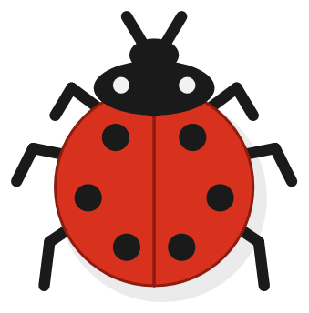
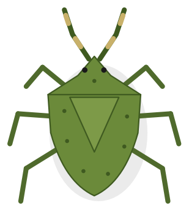
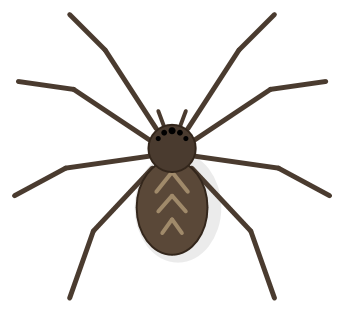
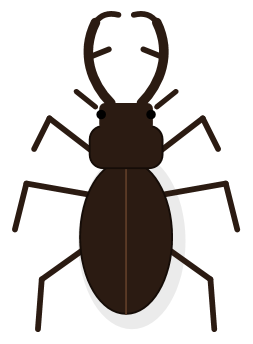
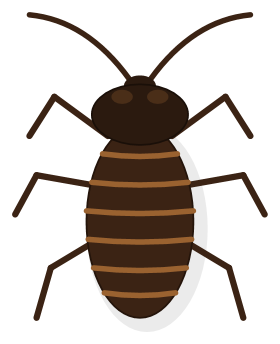
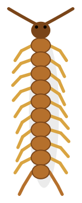
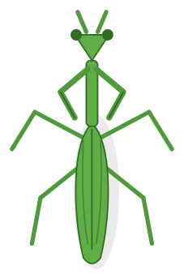

<div align="center">


# Screen Bugs

**Bugs crawl across your desktop. Click one and it splats.**

A tiny Windows tray app that puts a click-through overlay over your screen and walks
hand-drawn insects across it. They wander, they notice your cursor and scatter, and they
die under a well-aimed click. Everything else on your desktop keeps working normally.

[](https://github.com/Cadtastic/Screen-Bugs/releases/latest)
&nbsp;

&nbsp;


</div>

---

## Install

[**Download the latest installer**](https://github.com/Cadtastic/Screen-Bugs/releases/latest)
and run it. That's the whole thing — no .NET prerequisite, because the runtime is bundled.

The setup asks which bug you want, how many, whether to start with Windows, and whether you
want a desktop shortcut. You can install for everyone on the machine or just for yourself.

> The installer isn't code-signed, so SmartScreen will warn you the first time. Every release
> ships a `.sha256` next to the installer if you want to check what you downloaded.

---

## Meet the bugs

Nine species, each hand-drawn as vector art and animated leg-by-leg. Every image below is
rendered by the app's own painter — this is exactly what walks across your screen.

<table>
<tr>
<td align="center" width="33%">
<br>
<b>Black garden ant</b><br>
<sub>16 dip · busy and tiny</sub><br>
<sub>The default. Small enough to be genuinely hard to click.</sub>
</td>
<td align="center" width="33%">
<br>
<b>Red fire ant</b><br>
<sub>15 dip · the smallest</sub><br>
<sub>Slightly quicker than its black cousin, and angrier about it.</sub>
</td>
<td align="center" width="33%">
<br>
<b>Seven-spot ladybug</b><br>
<sub>22 dip · placid</sub><br>
<sub>Ambles about. The one you feel bad about squashing.</sub>
</td>
</tr>
<tr>
<td align="center">
<br>
<b>Stink bug</b><br>
<sub>28 dip · unhurried</sub><br>
<sub>Shield-backed and slow. Rarely in a rush to be anywhere.</sub>
</td>
<td align="center">
<br>
<b>House spider</b><br>
<sub>34 dip · twitchy</sub><br>
<sub>The fastest reflexes and the sharpest turns. Bolts, then freezes.</sub>
</td>
<td align="center">
<br>
<b>Stag beetle</b><br>
<sub>40 dip · armoured</sub><br>
<sub>Big mandibles, ponderous gait. Barely bothers to flee.</sub>
</td>
</tr>
<tr>
<td align="center">
<br>
<b>Hissing cockroach</b><br>
<sub>44 dip · the sprinter</sub><br>
<sub>Bolts at triple speed and spots you from further away than anything else.</sub>
</td>
<td align="center">
<br>
<b>Centipede</b><br>
<sub>50 dip · relentless</sub><br>
<sub>Ripples along on a dozen legs and almost never stops to rest.</sub>
</td>
<td align="center">
<br>
<b>Praying mantis</b><br>
<sub>56 dip · the biggest</sub><br>
<sub>Stalks. Slowest walker, slowest to react, entirely unbothered.</sub>
</td>
</tr>
</table>

Sizes above are body length in device-independent pixels; the images are scaled to a common
height so you can see the artwork, so a mantis is really about three and a half ants long.

---

## What they do

**They wander.** Each bug picks a heading, walks, pauses, and picks another. Legs swing in step
with the distance actually travelled, so the gait matches the speed rather than the clock.

**They flee.** Bring the cursor close and a bug notices — after a short reaction delay that
differs per species — then scatters at up to triple its walking speed. A spider reacts in
around 50 ms; a mantis takes up to 400 ms and often can't be bothered.

**They squash.** Click one and it becomes a fading splat in a darkened version of its own
colour. Clicks only land when you're actually over a bug; everywhere else they pass straight
through to whatever's underneath, so the overlay never gets in your way.

---

## Controls

Everything lives in the tray icon:

| Item | What it does |
| --- | --- |
| **Pause** / **Resume** | Freezes the bugs and hides the overlay |
| **Options…** | Opens the settings dialog below |
| **Exit** | Closes the app |

Double-click the tray icon to open Options directly.

### Options

| Setting | Range |
| --- | --- |
| **Number of types** | 1–10 rows, each a species or **Random** |
| **Speed** | Per row, 0.25× to 3× that species' natural pace |
| **Bugs on screen** | 1–50 |
| **Frame rate** | 30, 60 or 120 fps |
| **When types change** | Respawn everything, or let the current bugs age out |
| **Run at Windows startup** | On or off |

Changes preview live while the dialog is open — drag the count slider and bugs appear or
leave as you drag. **Cancel** puts everything back the way it was.

Settings live in `%LocalAppData%\ScreenBugs\settings.json`.

---

## Silent install

For scripted deployment:

```
ScreenBugs-Setup-1.0.0.exe /S /CURRENTUSER /BUGTYPE=HouseSpider /BUGCOUNT=12 /STARTUP=1 /DESKTOP=0
```

| Switch | Meaning |
| --- | --- |
| `/S` | Silent |
| `/ALLUSERS`, `/CURRENTUSER` | Install scope |
| `/BUGTYPE=` | `Random`, or a species name such as `HouseSpider` |
| `/BUGCOUNT=` | 1–50 |
| `/STARTUP=` | `1` or `0` |
| `/DESKTOP=` | `1` or `0` |
| `/D=` | Install directory — **must come last, and unquoted** |

The uninstaller takes `/S`, plus `/DELETEDATA=1` to remove your settings too.

Install-time choices apply the first time each user runs Screen Bugs. If you've used it
before, your saved settings are kept — change them from the Options dialog instead.

---

## Building from source

Needs the [.NET 10 SDK](https://dotnet.microsoft.com/download) and, for the installer,
[NSIS 3](https://nsis.sourceforge.io).

```bash
dotnet build ScreenBugs.slnx          # build
dotnet test tests/ScreenBugs.Tests    # 116 tests
pwsh build/build-installer.ps1        # publish + package the installer
pwsh build/verify-install.ps1         # install it four ways and assert the result
```

Two small tools regenerate the artwork, so the icon and the images above can never drift from
the code that draws them:

```bash
dotnet run --project tools/IconGen      # app icon + installer wizard images
dotnet run --project tools/BugRenderer  # the specimen images in this README
```

### Layout

| Path | What's in it |
| --- | --- |
| `src/ScreenBugs.Core` | Simulation and settings — pure, no UI, all the tests point here |
| `src/ScreenBugs` | The WPF app: overlay, painters, tray, options dialog |
| `installer/` | NSIS script and the custom options page |
| `build/` | Build and verification scripts |
| `docs/` | Design specs and implementation plans |

Releases are automated: push a `v*` tag and CI builds the installer, verifies it by actually
installing it, and publishes the release. The tag has to match `<Version>` in
`Directory.Build.props` or the build fails rather than shipping a mismatch.

---

## Good to know

- **Windows 10 (1607) or later, 64-bit.** The overlay and tray are Win32-specific.
- **Primary monitor only.** Bugs stay on the main screen.
- **One instance at a time**, guarded by a named mutex.
- If the app ever throws, it writes `%LocalAppData%\ScreenBugs\error.log` and exits rather
  than leaving a broken overlay on your screen.
